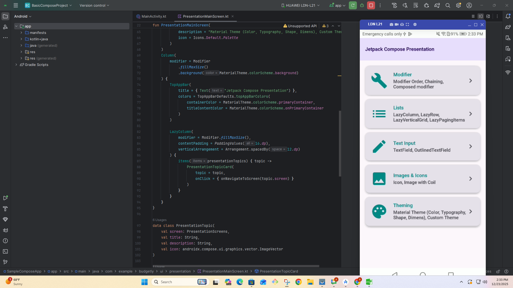

package:mine  InterAdLoaderX | NativeAdLoaderX | AppOpenAdX | BannerAdsLoaderX

  AdsManagerX.loadFirebaseRemoteConfig { cmpLog("firebase = before concent call") }

 fun cmpLog(message: String) {
        Log.d("showCmpAndInitAds", "$message")
    }
  

